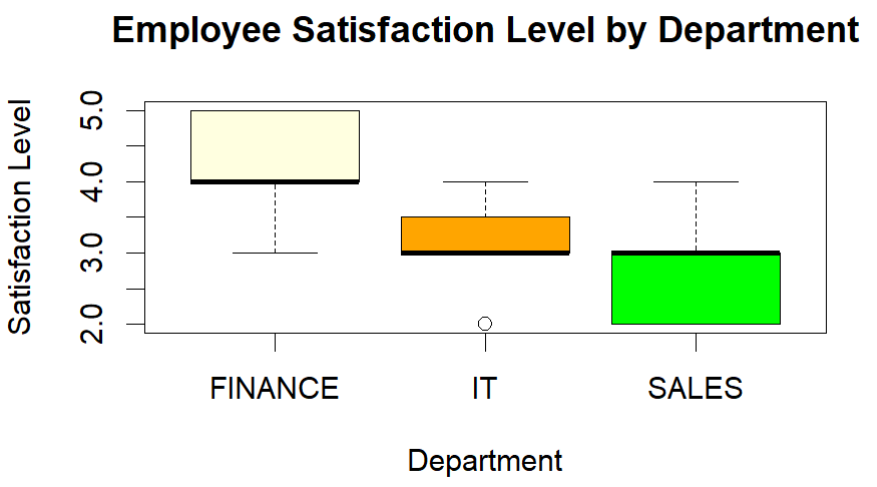

# Non-Parametric Analysis: Employee Satisfaction Survey

## Project Overview
This project presents a non-parametric statistical analysis conducted in R to evaluate employee satisfaction levels across different departments within a large organization.  
The analysis also examines whether employee satisfaction is associated with experience level.

## Business Context
An internal employee survey was conducted to assess satisfaction levels across multiple departments.  
Satisfaction was measured on a **1–5 scale**, where higher values indicate higher satisfaction.

## Objectives
1. Compare satisfaction levels across departments  
2. Test whether satisfaction differs significantly between roles  
3. Examine the association between satisfaction level and employee experience  
4. Identify departments with higher proportions of satisfied employees  

## Dataset
The dataset (`EMPLOYEE_SATISFACTION_SURVEY.csv`) is included in the repository and located in the root directory.

### Dataset Description
Key variables:
- `satlevel` — employee satisfaction level (1–5 scale)  
- `dept` — department (`IT`, `Sales`, `Finance`)  
- `exp` — years of experience  

Derived variable:
- `exp_level` — experience category (`junior` ≤ 2 years, `midlevel` > 2 years)

## Analysis Workflow
1. Data import and structure inspection  
2. Normality assessment of satisfaction levels  
3. Descriptive statistics (median satisfaction by department)  
4. Kruskal–Wallis test to compare satisfaction across departments  
5. Chi-square test to assess association between satisfaction and experience level  
6. Identification of highly satisfied employees by department  

## Methods and Techniques
- Exploratory data analysis:
  - Boxplots
- Normality tests:
  - Shapiro–Wilk test
  - Lilliefors (Kolmogorov–Smirnov) test
- Non-parametric statistical tests:
  - Kruskal–Wallis test
  - Chi-square test of independence

## Key Findings
- Satisfaction levels differ significantly across departments  
- The Finance department shows the highest median satisfaction  
- IT and Sales departments have similar median satisfaction levels  
- No statistically significant association was found between satisfaction level and experience level  
- Finance has the highest number of employees with satisfaction scores above 3  

## Visualization

## Tools and Skills
- R
- Non-parametric hypothesis testing
- HR analytics
- Survey data analysis
- Data visualization

## How to Run the Project
1. Clone the repository  
2. Open the R script  
3. The dataset (`EMPLOYEE_SATISFACTION_SURVEY.csv`) is already included in the repository 
4. Run the script sequentially  

## Notes
This project was completed for educational purposes and demonstrates the use of non-parametric statistical methods for analyzing ordinal survey data.
